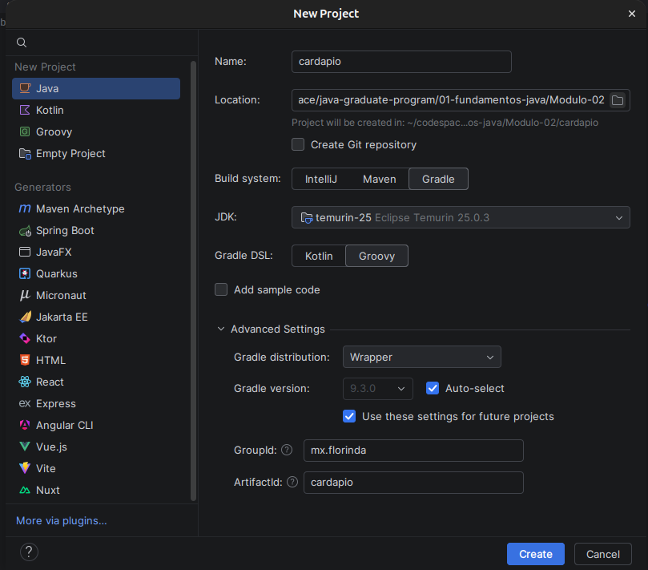
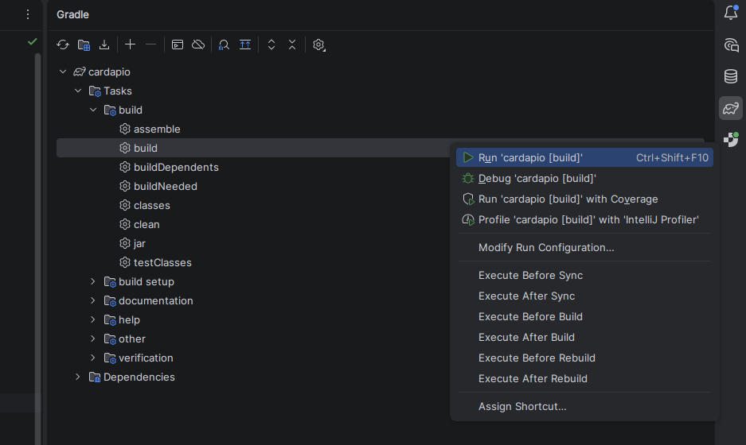

# Gradle

## Como instalar

Site: gradle.org

1. CLI

```
    gradle build
```
2. Gerendiador SDKMAN, brew, etc

3. Gradle Wrapper (método mais comum)

- Normamlmente ides como IntelliJ e eclispse já fazem isso

```
    ./gradlew build
```



- Arquivos criados
    - Scripts
        - gradlew - arquivo de sricpt para linux/ios
        - gradle.bat - arquivo de scritp para win

    
    - gradle/wrapper/
        - gradle-wrapper.jar  - Projeto JAVA minimo a partir da versão do gradle      
        - gradle-wrapper.pr   - Define versão do gradle em `distributionUrl`    


    - build.gradle
        - plugins: Compilar o java, compilar os testes, jar, javadoc
        - group
        - version
        - repositories: padrão mavenCentral() -> repositorio central do maven
        - dependencies
        - test: padrão useJunitPlataform()

    - settings.gradle
        - rootProject.name = 'cardapio'
        com este é o rootProject pode existir subProjects que ser adicionados neste arquivo

## Build no projeto
1. CLI

```
./gradlew build
```
1.1 Exemplo:
```shell
    pc@pc:~/cardapio$ ./gradlew build
        WARNING: A restricted method in java.lang.System has been called
        WARNING: java.lang.System::load has been called by net.rubygrapefruit.platform.internal.NativeLibraryLoader in an unnamed module (file:/home/porto/.gradle/wrapper/dists/gradle-9.3.0-bin/79n14ral3mx1ozqr3csh2u872/gradle-9.3.0/lib/native-platform-0.22-milestone-29.jar)
        WARNING: Use --enable-native-access=ALL-UNNAMED to avoid a warning for callers in this module
        WARNING: Restricted methods will be blocked in a future release unless native access is enabled


        Welcome to Gradle 9.3.0!

        Here are the highlights of this release:
        - Test reporting improvements
        - Error and warning improvements
        - Build authoring improvements

        For more details see https://docs.gradle.org/9.3.0/release-notes.html


        BUILD SUCCESSFUL in 919ms
        1 actionable task: 1 executed
        Consider enabling configuration cache to speed up this build: https://docs.gradle.org/9.3.0/userguide/configuration_cache_enabling.html
```
2. Pela IDE



## Outros comando do gradle

### task
```
./gradlew task
```
### dependencies
```
./gradlew dependencies
```